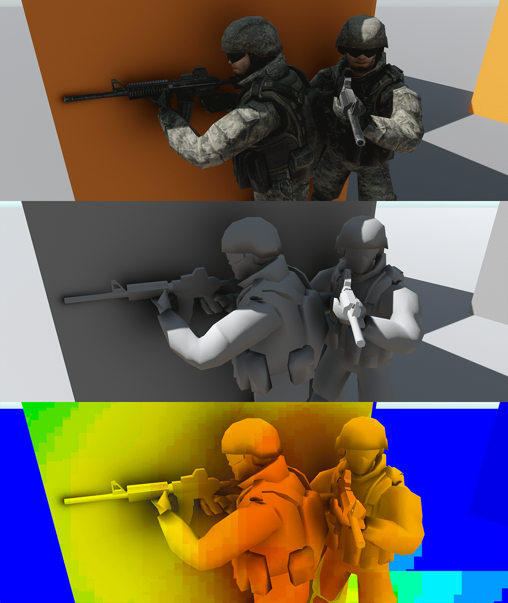

# Capsule Occlusion



# What is this?
A Unity package implementing capsule occlusion as seen in The Last Of Us[^1], Shadow Warrior 2[^2] and others. It is mainly intended to be used in forward rendering pipelines with MSAA (where SSAO is not viable).

To speed up rendering, capsules are gathered in clusters (implemented as a linked list on the GPU) which are used to limit per-pixel occlusion evaluation.

The clustering can be performed using either a naive compute shader or a single rasterization pass (which is the faster and preferred method).

# How do I use it?
1. Add the package to your project either using the Package Manager (Add package from GIT url...) or by manually placing it in your project's Packages folder (embedded package).
2. Add a ```CapsuleOcclusionCamera``` component to your camera.
3. In your shader, add ```#include "Packages/dev.fewes.capsuleocclusion/Shaders/CapsuleOcclusion.hlsl"```
4. In your shader, evaluate occlusion using the function ```GetCapsuleOcclusion(worldPos, worldNormal, screenUV, linear01Depth);```

# Areas of improvement
* Cone shadows could be implemented fairly easily. I chose not to do this because the overdraw ends up being a limiting factor and running it in full resolution with MSAA might be unrealistic.
* The linked list used for the clusters must have a max size (set by the ```Cluster Data Headroom``` parameter). If the number of cluster hits exceeds the list capacity, rendering bugs occur. It would be possible to detect when/before this happens using async readback operations and dynamically expand the list.
* Currently, the capsules are culled and sorted on the main thread for each camera. The code has been optimized a fair bit but still, it would be preferable to do this in a job.
* The cluster data is stored in an unsorted linked list, which likely results in poor cache performance. Bitonic sorting or similar could be used to improve this but was not implemented due to its high complexity.

# Acknowledgements
Original capsule occlusion approximation function by Inigo Quilez: https://www.shadertoy.com/view/llGyzG

[^1]: Lighting Technology of "The Last Of Us" - http://miciwan.com/SIGGRAPH2013/Lighting%20Technology%20of%20The%20Last%20Of%20Us.pdf
[^2]: Rendering of Shadow Warrior 2 - https://knarkowicz.files.wordpress.com/2017/05/knarkowicz_rendering_sw2_dd_20171.pdf
